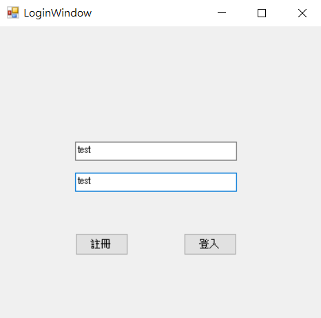
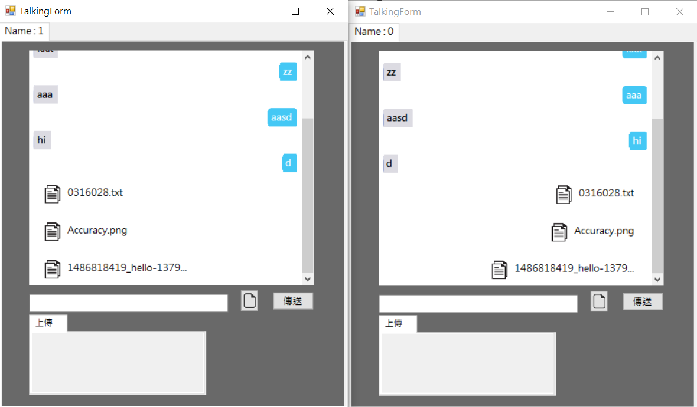
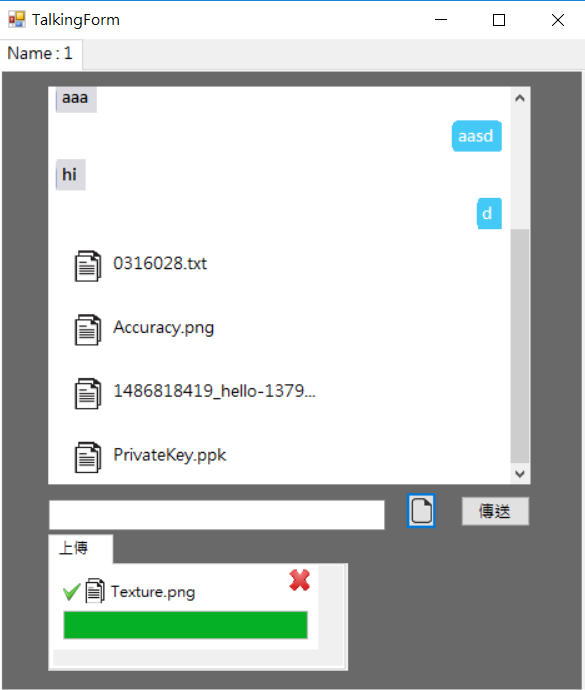
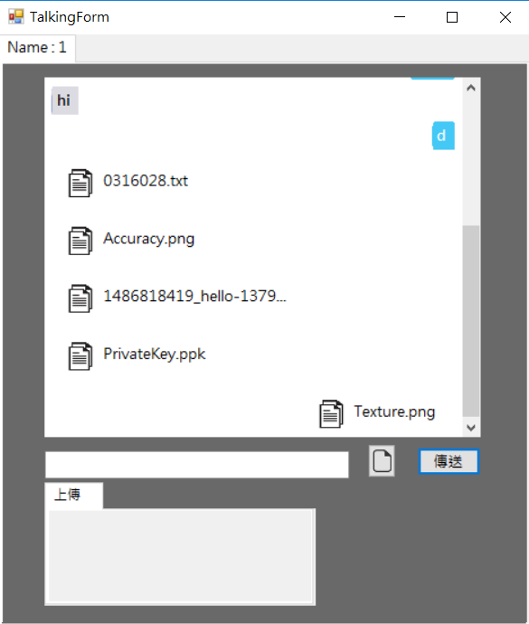
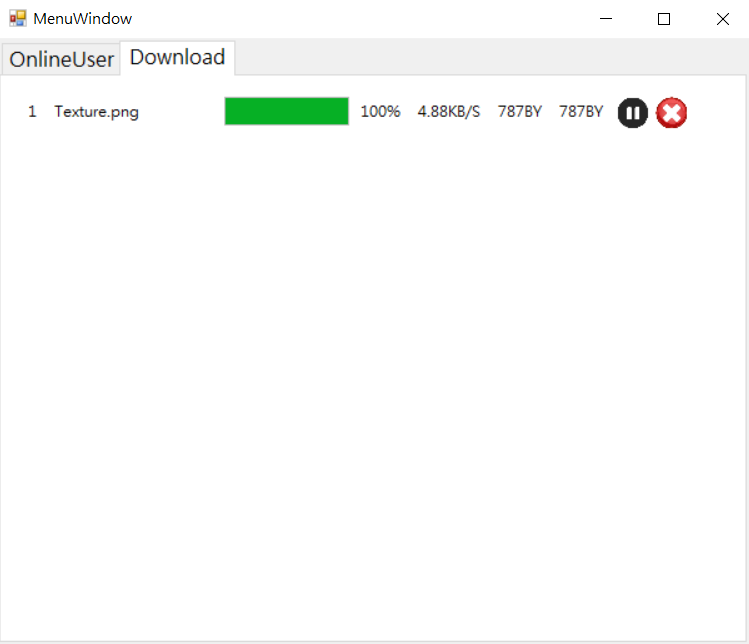
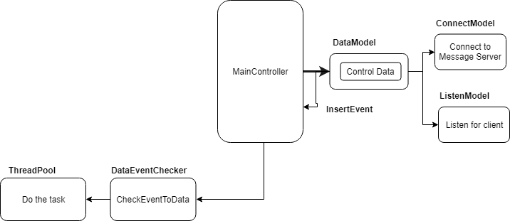
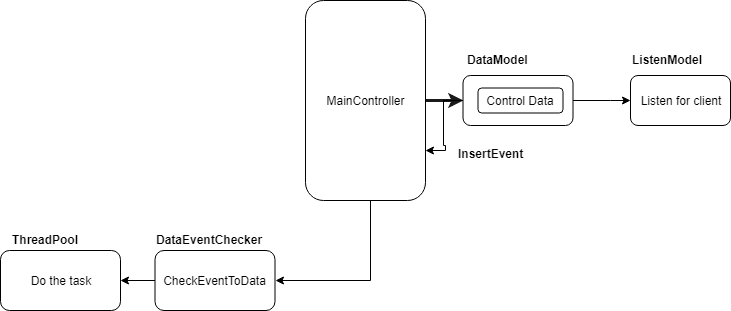
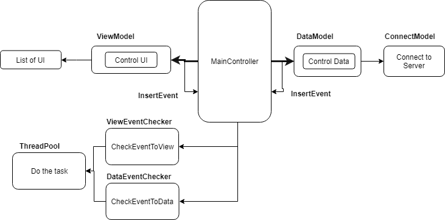

Communication Project
===================

### 1.功能

1. Login, Register

2. Send Message

3. Upload File

4. Download File

### 3.架構:

Login Server

Message Server

Client

## ThreadPool

把要做的task放在一個queue裡面，去Loop所有idle的thread，有idle的就把一個task dequeue出來執行，沒有的話就create thread直到THREAD_MAX_NUMBER。

## Command Format

Command的格式為

Command Length(int 4byte)
Event(1byte)
Parameters(List of Parameter)

## Serialize data

要在網路上傳遞的data勢必要是binary的形式，因此要定義serialize的格式

1. int : 4byte
2. bigint(long) : 8byte
3. string(UTF8_Encode) : length(4byte) + string_content
4. bytearray : length(4byte) + byte_array
5. byte : 1byte

Serialize的部分是用C#的BitConverter
Deserialzie是用我自己寫的MyConverter

##MVC

MainController : 有兩個EventChecker分別把對應的View or Data Event丟到ThreadPool執行
ViewModel : Controller UI, List of Event function about controller UI, Get the data info from datamodel
DataModel : Commnicate with database, Controll data, Communicate with Server(Newwork Connection)
